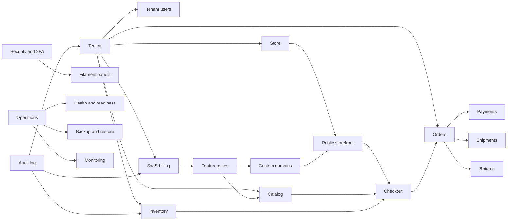

# Knowledge Graph

Last updated: 2026-06-02

This is a textual graph for agents. It maps core repository knowledge to source
paths and documents.

## System Nodes

## Domains

| Domain | Entities | Services/actions | Policies/tests | Primary docs |
|---|---|---|---|---|
| Tenancy | `Tenant`, `TenantUser`, `TenantInvitation`, `User` | `AcceptTenantInvitation`, `InviteTenantUser`, `TenantResolver`, `TenantSwitcher`, `CurrentTenant` | `TenantPolicy`, `TenantUserPolicy`, tenancy tests | `docs/TENANCY_RULES.md`, ADR 0002 |
| Stores | `Store`, `StoreSetting`, `ThemeSetting` | `EvaluateStoreReadiness`, `StoreReadinessChecker` | store/readiness tests | `docs/DOMAIN_CONTRACTS_SUMMARY.md`, `docs/STOREFRONT_THEME.md` |
| Catalog | `Category`, `Product`, `ProductImage` | `SearchStorefrontProducts` | catalog tests | `docs/ARCHITECTURE.md`, `docs/STOREFRONT_CART.md` |
| Variants | `ProductOption`, `ProductOptionValue`, `ProductVariant`, `ProductVariantOptionValue` | `ProductVariantOptionValueValidator` | variant schema/model tests | ADR 0013 |
| Inventory | `InventoryItem`, `StockMovement` | `AdjustInventoryManually`, `ReleaseOrderInventoryReservations`, `SettleOrderInventory`, `RestockOrderReturn` | inventory tests | `docs/DOMAIN_CONTRACTS_SUMMARY.md`, ADR 0013 |
| Checkout | `CheckoutIdempotencyRecord`, `Order`, `OrderItem`, `Customer` | `CreateQuickOrder`, `CheckoutIdempotency`, `CheckoutRequestHasher`, `CheckoutAbuseGuard` | quick checkout tests | `docs/STOREFRONT_CART.md`, ADR 0005, ADR 0006 |
| Orders | `Order`, `OrderItem`, `OrderStatusHistory` | order transition actions | order tests | domain contracts |
| Payments | `Payment`, `PaymentMethod` | `RecordOrderPayment`, `RefundOrderPayment`, `MarkOrderPaymentFailed` | payment tests | ADR 0009 |
| Shipping | `ShippingCompany`, `ShippingRate`, `Shipment`, `ShipmentStatusHistory` | shipment transition actions | shipping tests | ADR 0010 |
| Returns | `OrderReturn` | return transition actions | return tests | domain contracts |
| Billing | `Plan`, `PlanFeature`, `Subscription`, `Invoice`, `SubscriptionPayment`, `UsageCounter`, `FeatureFlag` | billing lifecycle and payment actions, `SubscriptionFeatureGate` | billing tests | domain contracts, security baseline |
| Coupons | `Coupon`, `CouponRedemption` | `CalculateCouponDiscount` | checkout/coupon coverage | domain contracts |
| Domains | `Domain` | `VerifyDomainOwnership`, `DomainDnsLookup`, `VerifyDomainOwnershipJob` | domain tests | deployment and domain docs |
| Security | `AuditLog`, 2FA fields on `User` | `AuditLogger`, `TwoFactorAuthentication`, `PanelAppAuthentication` | security and audit tests | `docs/SECURITY_BASELINE.md`, `docs/TWO_FACTOR_AUTH_AR.md` |
| Operations | no single model | `SystemHealthChecker`, console commands, deploy scripts | system health tests, smoke scripts | production/staging/runbook docs |

## Workflow Edges

| Workflow | Starts At | Depends On | Ends At |
|---|---|---|---|
| Storefront resolve | Host or fallback store identifier | `TenantResolver`, active domain/store, active/trial tenant | store context for Next.js |
| Product detail | Next.js product page | public API, product resource, active variants/options | purchasable UI state |
| Quick checkout | storefront form/cart | product visibility, variant validity, shipping rate, payment method, inventory, feature gate | pending order, payment, reservation movement |
| Order fulfillment | vendor panel action | order status policy, inventory settlement/release, shipment status | delivered/cancelled/returned state |
| Subscription lifecycle | scheduler or sync command | subscriptions, invoices, payment statuses, notifications | renewal, grace, past due, suspension |
| Domain verification | vendor/admin resource or job | DNS lookup, domain status, store relation | active/failed domain |
| Staging smoke | operator script | container images, env contract, Caddy/Nginx, health endpoints, demo data | dated evidence record |

## Source-Of-Truth Rules

- Backend is the source of truth for money, totals, discounts, shipping fees,
  payment status, inventory reservation, and subscription limits.
- Storefront is a UX surface. It must not become an authority for commerce facts.
- `ProductType` is the source of truth for simple vs variable product behavior.
- `tenant_id` is the source of isolation for tenant-owned data.
- `StockMovement` is the operational inventory ledger.
- `AuditLog` is the immutable security/business audit trail.
- Evidence records are source of historical proof, not current external state.
